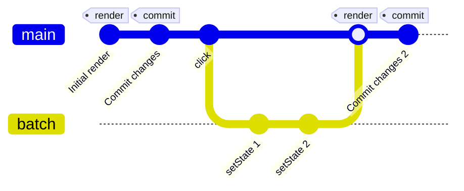
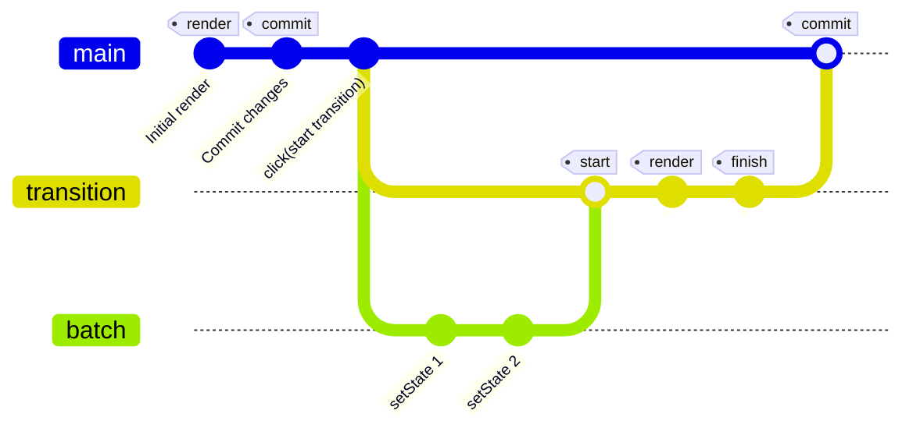
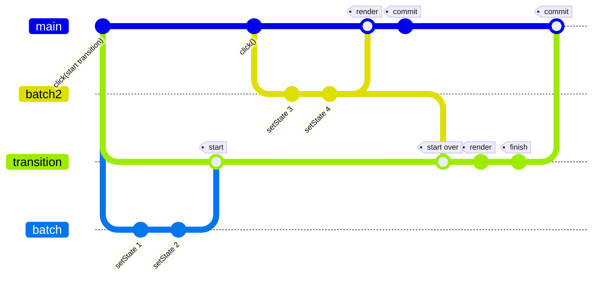

# React State
### let's _understand_ it better

---

# Agenda:

* State hooks
  * useState
  * useReducer
* Why keep state in React
* What *asynchronous* can mean
* When does React *actually* update
* Concurrent mode
  * External state & tearing

---

# useState

```tsx
import { useState } from 'react';

const Component = () => {
  const [state, setState] = useState(initial);
  return <div>{state}</div>
}
```


<v-click>

## Initialization

</v-click>
<v-click>

- `initial` can be a value or an initialization function
```tsx {1|2|all}
  useState(0)
  useState(() => 0)
```
</v-click>
<v-click>

- important to remember when storing a function
```tsx {1|2|all}
  useState(func) // this will store whatever func returns
  useState(() => func) // this will store func
```

</v-click>


---

# useState

```tsx
import { useState } from 'react';

const Component = () => {
  const [state, setState] = useState(initial);
  return <div>{state}</div>
}
```

## Updating

<v-click>

- update can be either a value or a function
```tsx {1|2|all}
  setState(0)
  setState((current) => 0)
```
</v-click>

<v-clicks>

- if the next state is derived from the previous one, prefer the latter form

- if you want to store a function you *must* use the latter form
</v-clicks>

--- 

## useState is only *syntactic sugar* for useReducer


---

# useReducer
```tsx
import { useReducer } from 'react';
import reducer from './reducer';

const Component = () => {
  const [state, dispatch] = useReducer(reducer, initialValue, initializer);
  return <div>{state}</div>
}
```
<v-click>

## Initialization

</v-click>

<v-clicks>

- `initialValue` is used *as-is*, even if it's a function, unlike `useState`
- if you need initialization logic, use the `initializer`, which is a 3rd, *optional* argument
  - it is called with the `initialValue`
  - the returned value will be used as the initial state *instead*

- `reducer` is a function with the following signature
  ```tsx
  type Reducer<State, Action> = (prevState: State, action: Action) => State
  ```
</v-clicks>

---

# useReducer
```tsx
import { useReducer } from 'react';
import reducer from './reducer';

const Component = () => {
  const [state, dispatch] = useReducer(reducer, initialValue, initializer);
  return <div>{state}</div>
}
```

## Updating

<v-clicks>

```ts
const [state, dispatch] = useReducer(reducer, initialValue, initializer)
//...
dispatch(action)
```
</v-clicks>

---

# Reducer

```ts {all|3|5-11|13-18|all}
import { useReducer } from 'react';

type SetStateAction<State> = State | ((prev: State) => State);

const reducer = <State>(prevState: State, action: SetStateAction<State>): State => {
  if(typeof action === 'function') {
    return action(prevState);
  } else {
    return action;
  }
}

export const useState = <T>(initialState?: State | (() => State)) => 
  useReducer(
    reducer,
    undefined,
    () => typeof initialState === 'function' ? initialState() : initialState
  )


```
---

# Why keep state in React?

<v-clicks>

* It's the only way of telling React to re-render
  * Class components used to have a `forceUpdate` method
  * It can be simulated in stateless components... by using state
* It allows for *concurrent mode* patterns
* It helps performance
  * React only re-renders the subtree affected
  * React automatically batches updates
  * State updates are *asynchronous*
</v-clicks>

---
layout: iframe-right
url: https://stackblitz.com/edit/react-ts-cgjyuw?devToolsHeight=80&embed=1&file=App.tsx&hideExplorer=1&view=preview
---

# State updates are *asynchronous*

```tsx{all|2,3,5,7,8,10,14-17|4,6,9,11|all}
const Counter = () => {
  const [state, setState] = React.useState(0);
  const increment = () => {
    console.log('before increment');
    setState((current) => {
      console.log('increment');
      return current + 1;
    });
    console.log('after increment');
  };
  console.log('render');
  return (
    <div>
      <p>{state}</p>
      <button onClick={increment}>
        Increment
      </button>
    </div>
  );
}
```

---

# What *asynchronous* can mean

The browser environment gives us multiple choices when to run our asynchronous code:

<v-clicks>

* microtasks
  * Run *immediately* after the call stack is empty
  * Can be created using `queueMicrotask` or `Promise.resolve`
* tasks
  * Run sometime in the future, when the event loop gets to it
  * Can be created using `setTimeout`, `MessageChannel` ports, event callbacks
* `requestAnimationFrame`
  * Runs *before* the next paint
</v-clicks>

---

# Which mechanism React usues?
Let's find out!
<v-click>

```ts{1-8|10-11|12-13|14-15}
const asyncLog = (
  message: string,
  queueMechanism: (cb: () => void) => void
) => {
  queueMechanism(() => {
    console.log(message);
  });
};

const logMicrotask = (message: string) => 
  asyncLog(message, queueMicrotask);
const logTimeout = (message: string) =>
  asyncLog(message, (cb) => setTimeout(cb, 0));
const logAnimationFrame = (message: string) =>
  asyncLog(message, requestAnimationFrame);
```
</v-click>

---
layout: iframe-right
url: https://stackblitz.com/edit/react-ts-bhgwtf?devToolsHeight=80&embed=1&file=App.tsx&hideExplorer=1&view=preview
---

For event callbacks, React uses *microtasks*

```tsx{all|6-10|all}
const Counter = () => {
  const [state, setState] = useState(0);
  const increment = () => 
    setState((current) => current + 1);

  const handler = () => {
    logMicrotask('before increment')
    increment()
    logMicrotask('after increment')
  };

  console.log('render');
  return (
    <div>
      <p>{state}</p>
      <button onClick={handler}>
        Increment
      </button>
    </div>
  );
}
```

---
layout: iframe-right
url: https://stackblitz.com/edit/react-ts-b9nz6d?devToolsHeight=80&embed=1&file=App.tsx&hideExplorer=1&view=preview
---

It doesn't matter how the callback was registered

```tsx{all|10-17,22|all}
const Counter = () => {
  const [state, setState] = useState(0);
  const increment = () => 
    setState((current) => current + 1);
  const handler = () => {
    logMicrotask('before increment');
    increment();
    logMicrotask('after increment');
  };
  const buttonRef = React.useRef(null);
  useEffect(() => {
    const btn = buttonRef.current;
    btn.addEventListener('click', handler);
    return () => 
      btn.removeEventListener('click', handler);
  });

  console.log('render');
  return (
    <div>
      <p>{state}</p>
      <button ref={buttonRef}>Increment</button>
    </div>
  );
}
```

---
layout: iframe-right
url: https://stackblitz.com/edit/react-ts-a3sacf?devToolsHeight=80&embed=1&file=App.tsx&hideExplorer=1&view=preview
---

But it does matter when it was triggered

```tsx{all|16-21|all}
const Counter = () => {
  const [state, setState] = React.useState(0);
  const increment = () => 
    setState((current) => current + 1);

  const handler = () => {
    logMicrotask('before increment');
    increment();
    logMicrotask('after increment');
  };

  console.log('render');
  return (
    <div>
      <p>{state}</p>
      <button 
        onClick={() => setTimeout(handler,0)}
      >
        Increment
      </button>
    </div>
  );
}
```


---
layout: iframe-right
url: https://stackblitz.com/edit/react-ts-hs14sc?devToolsHeight=80&embed=1&file=App.tsx&hideExplorer=1&view=preview
---

In which case React will use a timeout

```tsx{all|7,9|all}
const Counter = () => {
  const [state, setState] = React.useState(0);
  const increment = () => 
    setState((current) => current + 1);

  const handler = () => {
    logTimeout('before increment');
    increment();
    logTimeout('after increment');
  };

  console.log('render');
  return (
    <div>
      <p>{state}</p>
      <button 
        onClick={() => setTimeout(handler,0)}
      >
        Increment
      </button>
    </div>
  );
}
```

---

# React state update timing
<v-clicks>

* For *event handlers*, React will use *microtasks*
  * This ensures that all listeners for this event get triggered before the next render
* For other callbacks, React will schedule a *task*
  * This ensures that all pending tasks are handled before the next render
</v-clicks>

<v-click>

This also means, that this function will trigger 1 or 2 re-renders, depending on where it was called
```ts
const handleIncrement = async () => {
  await increment()
  await increment()
}
``` 
</v-click>
<v-click>

There is also an escape hatch. You can use `flushSync` from `react-dom` to *synchronously* update state
</v-click>

---

# When to `flushSync`?

<v-clicks>

* If you need to call an imperative API after updating the state
  ```ts
  const [items, setItems] = useState([])
  ...
  const handleAdd = (newItem) => {
    flushSync(() => {
      setItems(current => [...current, newItem])
    })
    // these lines run after render
    const element = getElementForItem(item)
    element.scrollIntoView()
  }
  ```
* If you need to integrate with a 3rd party library that exposes an imperative API
* Overall, should be used with care and not overused, as it opts-out of batching.

</v-clicks>

---

# Concurrent mode

Concurrent mode allows the developer to mark some state updates as non-critical. These changes will be applied in a "forked" state tree, which will be "merged" back, when the background render is finished. React calls the fork a `transition` and provides the following tools:
<v-clicks>

* `startTransition` - useful to trigger a transition from any place, not necessarily a component.
  * Accepts a single argument, a callback which should call `setState`s to be processed in the background 
* `useTransition` - useful to additinally know if we are transitioning
  * accepts no arguments, returns a `[isPending, startTransition]` tuple
* `useDeferredValue` - accepts a single argument and returns a value of the same type
  * the returned value is equal to the argument in the "fork"
  * it may be different in the "main" tree
  * it is a declarative version of `useTransition`
</v-clicks>
<v-click>

Updates wrapped in a transition never trigger a suspense. The transition will be suspended instead, hence this is a way of avoiding fallback content.
</v-click>


---

# React state update, visualized 

<v-click>

* Regular update flow

</v-click>
<v-click>

* Concurrent update flow

</v-click>

---

# State updates in concurrent mode



<v-click>

The above graph holds, as long as React *knows* about the state updates.
</v-click>

---

# Synchronising *external* state

<v-show>

Sometimes our state grows and we want to use better tooling to manage it. Or we need to use it also outside of React. How to keep our tree in sync?
</v-show>

<v-click>

This is how we used to do it. But it causes a very subtle bug in concurrent mode.
```ts
import store from './store'

export const useStore = () => {
  const [state, setState] = useState(store.getState());

  useEffect(() => {
    const handleStoreUpdate = () => setState(store.getState());
    const unsubscribe = store.subscribe(handleStoreUpdate);

    return unsubscribe
  }, []);

  return state;
}
```
</v-click>

---
layout: iframe-right
url: https://stackblitz.com/edit/react-ts-1aq1hn?embed=1&file=SlowComponent.tsx&view=preview
---

# Tearing

```tsx{all|1,5-9,12,16-24|2-4,12|all}
const [show, setShow] = React.useState(false);
const updateStore = () => {
  update(Date.now());
};
const handleClick = () => {
  startTransition(() => {
    setShow((current) => !current);
  });
};
return (
  <div>
    <button onClick={handleClick}>Toggle!</button>
    <button onClick={updateStore}>
      Update state
    </button>
    {show && (
      <div>
        <SlowComponent />
        <SlowComponent />
        <SlowComponent />
        <SlowComponent />
        <SlowComponent />
      </div>
    )}
  </div>
);
```

---
layout: iframe-right
url: https://stackblitz.com/edit/react-ts-6uaips?embed=1&file=useStore.tsx&view=preview
---
# Tearing, fixed

<v-show>

`useSyncExternalStore` is a hook which should be used to synchronise external state with React.
</v-show>
<v-clicks>

* It accepts three arguments:
  * `subscribe` - it takes a single `callback` which subscribes to the store and returns an `unsubscribe` method
  * `getSnapshot` - it returns the store's current state
  * (optional) `getServerSnapshot` - used for SSR & initial hydration
* It returns the *current* state of the store
* It ensures that it is *always* in sync with the store
</v-clicks>

---

# Sources

1. React docs (https://beta.reactjs.org/)
2. In the loop (https://youtu.be/cCOL7MC4Pl0/)
3. React concurrency discussion (https://github.com/reactwg/react-18/discussions/70)
